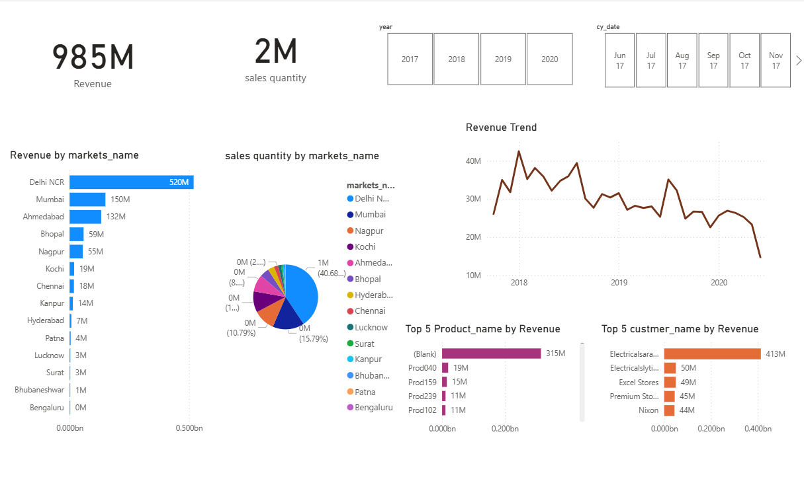

# 📊 Sales Analytics Dashboard (Power BI)

### 📘 Overview
This project presents an **interactive Power BI dashboard** designed and deployed using an **SQL database** and **GitHub dataset**.  
It visualizes key business metrics to help track sales performance and support data-driven decisions.

---

### 🎯 Objectives
- To analyze company-wide sales trends and performance metrics.  
- To identify **top-performing products**, **revenue contributions**, and **market-wise sales distribution**.  
- To provide insights that support strategic decision-making.

---

### 📈 Key Highlights
- **Total Revenue:** $985M  
- **Sales Quantity:** 2M units  
- **Time Trends:** Yearly and monthly performance tracking  
- **Market Insights:** Region-wise and product-wise sales breakdown  
- **Customer Analysis:** Revenue contribution by top customers  

---

### 🧰 Tools & Technologies
- **Power BI** – Dashboard design and data visualization  
- **SQL** – Database integration and data queries  
- 
---

### 🖼️ Dashboard Preview

---

### 📂 Files Included
| File Name | Description |
|------------|-------------|
| `SalesDashboard.pbix` | Power BI dashboard file |
| `dashboard_preview.png` | Dashboard preview image |
| `README.md` | Project documentation |

---

### 💡 Insights & Learnings
- Discovered sales seasonality and high-performing months.  
- Identified top 5 markets contributing to 80% of total revenue.  
- Enhanced data storytelling using Power BI visuals and filters.

---

### 🧑‍💻 Author
**Dhanyashree Bhat**  
📧 dhanyashree7022@gmail.com 
🔗 [LinkedIn Profile](https://www.linkedin.com/in/dhanyashree-bhat-7b0aa5318)  
💻 [GitHub Repository](https://github.com/dhanyashree-mit/Power_BI)

---

### 🏷️ Tags
`#PowerBI` `#DataAnalytics` `#SQL` `#Dashboard` `#BusinessIntelligence`

